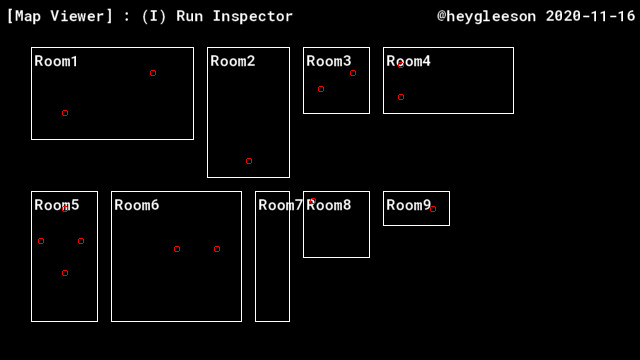

# 🔎 The Room Inspector 1.0
_Get data about a different room (for GameMaker Studio 2.3.0)_
&nbsp;

<b><a href="">Download .yymps</a></b>

A tiny 'run-once' object that visits every room and produces a JSON file filled with room data you can add to your project.

Since GameMaker Studio is currently short of functions such as `room_get_width()` or `room_get_height()`, it can be difficult to get information about a room _you are not currently in_. This inspector will collect that data for you, as well as anything else about a room that you specify, for example:
- Instance Positions
- Variables modified after the 'Room Creation' event.

Handy for projects that make extensive use of GameMaker's Room Editor.

## Example Project

The project folder includes an example for a 'Map Viewer', which shows an in-game visual of every room in the game, showing the size, name, and location of objects placed within the room. 

## Credits
Included in this tool are the scripts `snap_to_json` and `snap_from_json` from Juju Adam's <a href="https://github.com/JujuAdams/SNAP">SNAP</a>. Thanks Juju ♥
